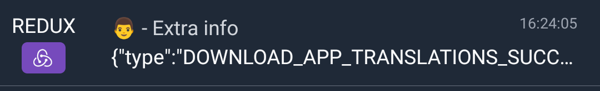

<p align="center">
  
</p>

[](https://travis-ci.org/odemolliens/react-native-netwatch)


# React Native Netwatch

Network traffic logger for React Native. <br/>
Includes an interface to see http traffic from RN and native side

## Features

- Log network requests coming from React Native side
- Log network requests coming from the native side (iOS and Android) (optional)
- Log Redux actions (optional)
- Shake the device to display the tool
- View details of each request/action
- Generate and share the list of requests/actions in Excel (XLSX) file
- Log connectivity change
- Show stats between success/warning/failure requests

## Example app

<p float="left" align="center">
  
</p>

---

## Getting started

### Dependencies

To avoid to have too much dependencies and conflict versions, before install, you must have these dependancies in your react-native project.

- react-native-paper
- react-native-fs
- react-native-share
- @react-native-community/netinfo

#### Fonts

Netwatch has react-native-vector-icons as dependency. Be sure that you have these fonts installed in your project:

- Fontisto
- Feather
- MaterialCommunityIcons

Please refer to this page for more details: <a href='https://github.com/oblador/react-native-vector-icons#ios'>Install fonts react-native-vector-icons</a>

### Installation

```bash
yarn add react-native-netwatch
```

or

```bash
npm install react-native-netwatch
```

### iOS

Inside your project, go to ios directory and execute pod install

```bash
cd ios && pod install && ..
```

OR simply

```bash
npx pod-install
```

---

## Usage

### Using Netwatch component

If you want add Network traffic in your project, just import 'react-native-netwatch'</br>
and add the Netwatch component in the most higher position in the tree of components.</br>
For example, just after your store provider or your root component

Now, when you will launch your application and shake the device, it will display automatically Netwatch.

### How to activate Netwatch

You have two possibilities to activate Netwatch in your project. With a button from you app or by shaking your phone. If you want activate
Netwatch with a button from your app, you **must** disable shake and instead pass the props onPressClose and visible.

#### Active Netwatch by shaking your phone

```javascript

import { Netwatch } from 'react-native-netwatch';

const App = () => {
  const [netwatchVisible, setNetwatchVisible] = useState(false);

  return (
    <Provider store={store}>
      <Netwatch
        enabled={true}
        interceptIOS={true}
      />
      <AppNavigator />
    </Provider>
  );
};

export default App;
```

#### Active Netwatch with a button

```javascript

import { Netwatch } from 'react-native-netwatch';

const App = () => {
  const [netwatchVisible, setNetwatchVisible] = useState(false);

  return (
    <Provider store={store}>
      <Netwatch
        enabled={true}
        interceptIOS={true}
        visible={netwatchVisible}
        onPressClose={() => setNetwatchVisible(false)}
        disableShake
      />
        <TouchableHighlight
          style={styles.openButton}
          onPress={() => setNetwatchVisible(true)}
          testID="buttonDisplayNetwatch"
        >
          <Text style={styles.textStyle}>Display Netwatch</Text>
        </TouchableHighlight>
      <AppNavigator />
    </Provider>
  );
};

export default App;
```

### Using Netwatch as Redux middleware (optional)

You can add 'react-native-netwatch' as a middleware to catch Redux actions</br>
To do that, just import reduxLogger from 'react-native-netwatch'</br>

```javascript
import { applyMiddleware, combineReducers, compose, createStore } from 'redux';
import appActionsReducer from './reducers/appActionsReducer';
import { reduxLogger } from 'react-native-netwatch';

const createReducer = () => (state, action) =>
  combineReducers({
    app: appActionsReducer,
  })(state, action);

const store = createStore(
  createReducer(),
  compose(applyMiddleware(reduxLogger)),
);

export default store;

```

Example in our demo application [here](https://github.com/odemolliens/react-native-netwatch/blob/5b6d19f40d7dc98cedb665172503fed93a8b0ae8/example/src/redux/store.ts#L23)

### Using Netwatch to intercept and display native requests

#### Android (optional)

To be able to intercept requests from Android side and display them into Netwatch</br>
You have to add to your OkHttp client Netwatch interceptor

```java
okHttpClient.addInterceptor(new NetwatchInterceptor(context));
```

Example in our demo application [here](https://github.com/odemolliens/react-native-netwatch/blob/5b6d19f40d7dc98cedb665172503fed93a8b0ae8/example/android/app/src/main/java/com/example/ExampleModule.java#L24)

#### iOS (optional)

Nothing to do on native side for the iOS.</br>
You have just to set `interceptIOS` to true and it will intercept requests which use `URLProtocol` on native side and display them into Netwatch</br>

- To intercept request sent with Alamofire

```objective-c
'Bridging-Header.h'

#import <NetwatchInterceptor.h>
```

```swift
let configuration = URLSessionConfiguration.default
configuration.protocolClasses?.insert(NetwatchInterceptor.self, at: 0)
let sessionManager = Alamofire.SessionManager(configuration: configuration)
sessionManager.request(...)
```

### Show stats

You can have statistics and see how many requests are succeeded or failed. By default, the indicator is closed. If you want the percentage, just press the indactor to opened it. Press again to close.

<p float="left" align="center">
  
  
</p>

If you have applied a filter, stats are updated for current filtered view. If you have filtered to see Redux Action, the indicator is not interactive and just show a purple indicator.

<p float="left" align="center">
  

### Add extra informations into Redux Action items (optional)

If you want, you can add extra datas in the redux items to have more visual information. Instead of just see 'redux action' as label, your own text will be displayed.
To do that, you must passed to Netwatch a props called reduxConfig. This is an object where each key correspond to a redux action in your project.
All values **must** be string.

```javascript

import { Netwatch } from 'react-native-netwatch';

const reduxConfigExample = {
  DOWNLOAD_APP_TRANSLATIONS_SUCCESS: "👨 - Extra info",
}

const App = () => {
  const [netwatchVisible, setNetwatchVisible] = useState(false);

  return (
    <Provider store={store}>
      <Netwatch
        enabled={true}
        interceptIOS={true}
        reduxConfig={reduxConfigExample}
      />
      <AppNavigator />
    </Provider>
  );
};

export default App;
```

You will see something like that:

<p float="left" align="center">
  
</p>

### ⚠️ Using Netwatch with Reactotron

There is a known incompatibility between Netwatch and Reactotron. If you want to redirect the requests into Reactotron, you should set the props `useReactotron` to **true** (have to reload the app if you edit its value). To go back to netwatch revert the props to false and reload again.

At this moment, it is not possible to display requests into Netwatch and Reactotron at the same time. You **must** choose between these tools.

## Props

|    Params     |   Type   |  Default  | Mandatory ? | Description                                                  |
| :-----------: | :------: | :-------: | :---------: | :----------------------------------------------------------- |
|    enabled    | Boolean  |   true    |   **yes**   | Enabled/Disabled logger to intercept request and actions     |
|    visible    | Boolean  |   false   |     no      | Show the main screen to display intercepted requests/actions |
| onPressClose  | Function | undefined |     no      | Called when Close button is pressed in the Main screen       |
| interceptIOS  | Boolean  |   false   |     no      | Intercept native iOS requests                                |
| disableShake  | Boolean  |   false   |     no      | Set to true to disable shake feature to display Netwatch     |
|  maxRequests  |  Number  |    100    |     no      | Maximum requests displayed                                   |
|   showStats   | Boolean  |   true    |     no      | Show stats indicator                                         |
|  reduxConfig  |  Object  |    {}     |     no      | Extra infos for Redux Action. Accept only string as vaulues  |
| useReactotron | Boolean  |   false   |     no      | Redirect requests to Reactotron instead of Netwatch          |
|     theme     |  String  |  'dark'   |     no      | Possible values are 'dark' or 'light'                        |


## Mocking Responses

Netwatch also provides a way to mock responses which is useful during testing and development.

## Using Netwatch UI for Mocking

Netwatch UI provides a user-friendly way to create, export, and import mocks directly from the mobile application.

### Creating Mocks

To create a mock:

1. Open the Netwatch UI by shaking the device or triggering the configured gesture.
2. Tap on any HTTP request in the list.
3. Tap on the "Mock Request" button.
4. Fill in the HTTP method, URL, status code, and response body fields. (leave blank to keep the original value)
5. Tap "Save".

<p float="left" align="center">
  
</p>

### Exporting Mocks

To export a mock:

1. Open the Netwatch UI.
2. Navigate to the "Mock List" screen by tapping top right hamburger menu.
3. Tap export button in the navigation bar.

The mock will be copied to the clipboard in a JSON format.

<p float="left" align="center">
  
</p>

### Importing Mocks

To import a mock:

1. Copy the mock JSON to your clipboard.
2. Open the Netwatch UI.
3. Navigate to the "Mocked List" screen by tapping top right hamburger menu.
4. Tap on the "Import" button.

The mock from the clipboard will be parsed and added to the list of mocked requests.

<p float="left" align="center">
  
</p>

## Enabling and Disabling Mocks

You can easily control which mock responses are active at any time using the Netwatch UI.

### Enabling a Mock

To enable a mock:

1. Open the Netwatch UI.
2. Navigate to the "Mock List" screen by tapping top right hamburger menu.
3. Find the mock response you want to enable.
4. Tap on the mock response. When the switch is on the right and highlighted, the mock is enabled.

### Disabling a Mock

To disable a mock:

1. Open the Netwatch UI.
2. Navigate to the "Mock List" screen by tapping top right hamburger menu.
3. Find the mock response you want to disable.
4. Tap on the mock response. When the switch is on the left and grayed out, the mock is disabled.


<p float="left" align="center">
  
</p>

## Using presets for fast Mocking

Netwatch provides three ways to mock responses with presets using props: 

- via clipboard (`loadMockPresetFromClipboard`)
- via input parameters (`loadMockPresetFromInputParameters`)
- via the `mockPresets` prop.

### `mockPresets`

`mockPresets` is an array of `MockResponse` objects defining the mock HTTP request/response behavior.

```jsx
const mockResponses = [
  {
    method: 'GET',
    url: '/api/v1/users',
    status: 200,
    body: { message: 'Success' },
  },
];

<Netwatch mockPresets={mockResponses} enabled={true} />;
```

### `loadMockPresetFromClipboard`

Copy your mock response data to your clipboard in the correct format and set `loadMockPresetFromClipboard` to `true`.

### `loadMockPresetFromInputParameters`

Set `loadMockPresetFromInputParameters` to `true` and pass the mock data as the `mockPresets` prop.

*Note: If both `loadMockPresetFromClipboard` and `loadMockPresetFromInputParameters` are `true`, the data from the clipboard will be used.*

## Advanced Mocking Examples

### Simulating Request Timeouts

Simulate request timeouts with the `timeout` field in `MockResponse`.

```jsx
const mockResponses = [
  {
    method: 'GET',
    url: '/api/v1/users',
    status: 200,
    body: { message: 'Success' },
    timeout: 5, // Simulates a delay of 5 seconds
  },
];

<Netwatch mockPresets={mockResponses} enabled={true} />;
```

### HTTP Headers Mocking

Mock HTTP headers with the `headers` field in `MockResponse`.

```jsx
const mockResponses = [
  {
    method: 'GET',
    url: '/api/v1/users',
    status: 200,
    body: { message: 'Success' },
    headers: {
      'Content-Type': 'application/json',
      'X-Custom-Header': 'CustomHeaderValue',
    },
  },
];

<Netwatch mockPresets={mockResponses} enabled={true} />;
```

### Simulating HTTP Error Statuses

Simulate HTTP error statuses such as 401, 500, and 400.

```jsx
const mockResponses = [
  {
    method: 'GET',
    url: '/api/v1/secure',
    status: 401,
    body: { message: 'Unauthorized' },
  },
  {
    method: 'POST',
    url: '/api/v1/users',
    status: 500,
    body: { message: 'Internal Server Error' },
  },
  {
    method: 'POST',
    url: '/api/v1/users',
    status: 400,
    body: { message: 'Bad Request' },
  },
];

<Netwatch mockPresets={mockResponses} enabled={true} />;
```

## Launching App with Netwatch Mocks using Appium

You can integrate Netwatch with Appium to facilitate your automation testing.

### iOS

Use Appium's `mobile: launchApp` method to start your app with specified parameters:

```javascript
const mockResponses = [
  {
    method: 'GET',
    url: '/api/v1/users',
    status: 200,
    body: { message: 'Success' }
  }
];

driver.execute('mobile: launchApp', {
  sessionId: driver.sessionId,
  bundleId: driver.capabilities.bundleId,
  arguments: ['-netwatchMocks', JSON.stringify(mockResponses)],
});
```

Then in your React Native application, set `loadMockPresetFromInputParameters` to `true`:

```jsx
<Netwatch enabled={true} loadMockPresetFromInputParameters={true} />
```

### Android

For Android, use Appium's `startActivity` method:

```javascript
const mockResponses = [
  {
    method: 'GET',
    url: '/api/v1/users',
    status: 200,
    body: { message: 'Success' }
  }
];

driver.startActivity(
  driver.capabilities.appPackage,
  driver.capabilities.appActivity,
  undefined,
  undefined,
  undefined,
  undefined,
  undefined,
  `--es 'netwatchMocks' '${JSON.stringify(mockResponses)}'`
);
```

Then in your React Native application, set `loadMockPresetFromInputParameters` to `true`:

```jsx
<Netwatch enabled={true} loadMockPresetFromInputParameters={true} />
```

