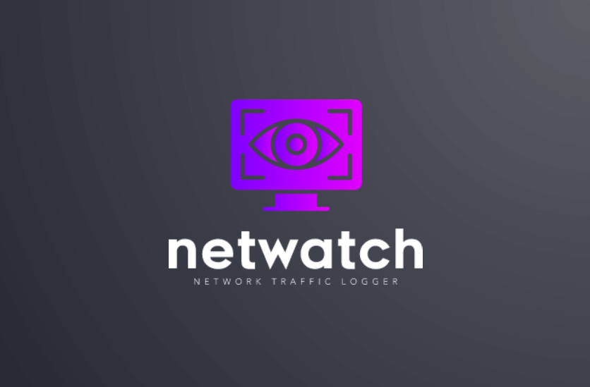

<p align="center">
  
</p>

[](https://travis-ci.org/imranMnts/react-native-netwatch)


# React Native Netwatch

Network traffic logger for React Native. <br/>
Includes an interface to see http traffic from RN and native side

## Features

- Log network requests coming from React Native side
- Log connectivity change
- Log network requests coming from the native side (iOS and Android) (optional)
- Log Redux actions (optional)
- Shake the device to display the tool
- View details of each request/action
- Generate and share the list of requests/actions in Excel (XLSX) file

## Example app

<p float="left" align="center">
  
</p>

---

## Getting started

### Dependencies

To avoid to have too much dependencies and conflict versions, before install, you must have these dependancies in your react-native project.

- react-native-paper
- react-native-fs
- react-native-share
- @react-native-community/netinfo

Netwatch has react-native-vector-icons as dependency. Be sure that you have these fonts installed in your project:

- Fontisto
- Feather
- MaterialCommunityIcons

Please refer to this page for more details: <a href='https://github.com/oblador/react-native-vector-icons#ios'>Install fonts react-native-vector-icons</a>

### Installation

```bash
yarn add react-native-netwatch
```

or

```bash
npm install react-native-netwatch
```

### iOS

Inside your project, go to ios directory and execute pod install

```bash
cd ios && pod install && ..
```

OR simply

```bash
npx pod-install
```

---

## Usage

### Using Netwatch component

If you want add Network traffic in your project, just import 'react-native-netwatch'</br>
and add the Netwatch component in the most higher position in the tree of components.</br>
For example, just after your store provider or your root component

Now, when you will launch your application and shake the device, it will display automatically Netwatch.

### How to activate Netwatch

You have two possibilities to activate Netwatch in your project. With a button from you app or by shaking your phone. If you want activate 
Netwatch with a button from your app, you **must** disable shake and instead pass the props onPressClose and visible.

#### Active Netwatch by shaking your phone
```javascript
{...}

import { Netwatch } from 'react-native-netwatch';

const App = () => {
  const [netwatchVisible, setNetwatchVisible] = useState(false);

  return (
    <Provider store={store}>
      <Netwatch
        enabled={true}
        interceptIOS={true}
      />
      <AppNavigator />
    </Provider>
  );
};

export default App;
```

#### Active Netwatch with a button
```javascript
{...}

import { Netwatch } from 'react-native-netwatch';

const App = () => {
  const [netwatchVisible, setNetwatchVisible] = useState(false);

  return (
    <Provider store={store}>
      <Netwatch
        enabled={true}
        interceptIOS={true}
        visible={netwatchVisible}
        onPressClose={() => setNetwatchVisible(false)}
        disableShake
      />
        <TouchableHighlight
          style={styles.openButton}
          onPress={() => setNetwatchVisible(true)}
          testID="buttonDisplayNetwatch"
        >
          <Text style={styles.textStyle}>Display Netwatch</Text>
        </TouchableHighlight>
      <AppNavigator />
    </Provider>
  );
};

export default App;
```

### Using Netwatch as Redux middleware (optional)

You can add 'react-native-netwatch' as a middleware to catch Redux actions</br>
To do that, just import reduxLogger from 'react-native-netwatch'</br>

```javascript
import { applyMiddleware, combineReducers, compose, createStore } from 'redux';
import appActionsReducer from './reducers/appActionsReducer';
import { reduxLogger } from 'react-native-netwatch';

const createReducer = () => (state, action) =>
  combineReducers({
    app: appActionsReducer,
  })(state, action);

const store = createStore(
  createReducer(),
  compose(applyMiddleware(reduxLogger)actionLog.enhancer),
);

export default store;

```

Example in our demo application [here](https://github.com/odemolliens/react-native-netwatch/blob/5b6d19f40d7dc98cedb665172503fed93a8b0ae8/example/src/redux/store.ts#L23)

### Using Netwatch to intercept and display native requests

#### Android (optional)

To be able to intercept requests from Android side and display them into Netwatch</br>
You have to add to your OkHttp client Netwatch interceptor

```java
okHttpClient.addInterceptor(new NetwatchInterceptor(context));
```

Example in our demo application [here](https://github.com/odemolliens/react-native-netwatch/blob/5b6d19f40d7dc98cedb665172503fed93a8b0ae8/example/android/app/src/main/java/com/example/ExampleModule.java#L24)

#### iOS (optional)

Nothing to do on native side for the iOS.</br>
You have just to set `interceptIOS` to true and it will intercept requests which use `URLProtocol` on native side and display them into Netwatch</br>

- To intercept request sent with Alamofire

```objective-c
'Bridging-Header.h'

#import <NetwatchInterceptor.h>
```

```swift
let configuration = URLSessionConfiguration.default
configuration.protocolClasses?.insert(NetwatchInterceptor.self, at: 0)
let sessionManager = Alamofire.SessionManager(configuration: configuration)
sessionManager.request(...)
```

## Props

|    Params    |   Type   |  Default  | Mandatory ? | Description                                                  |
| :----------: | :------: | :-------: | :---------: | :----------------------------------------------------------- |
|   enabled    | Boolean  |   true    |   **yes**   | Enabled/Disabled logger to intercept request and actions     |
|   visible    | Boolean  |   false   |     no      | Show the main screen to display intercepted requests/actions |
| onPressClose | Function | undefined |     no      | Called when Close button is pressed in the Main screen       |
| interceptIOS | Boolean  |   false   |     no      | Intercept native iOS requests                                |
| disableShake | Boolean  |   false   |     no      | Set to true to disable shake feature to display Netwatch     |
| maxRequests  |  Number  |    100    |     no      | Maximum requests displayed                                   |
|    theme     |  String  |  'dark'   |     no      | Possible values are 'dark' or 'light'                        |
